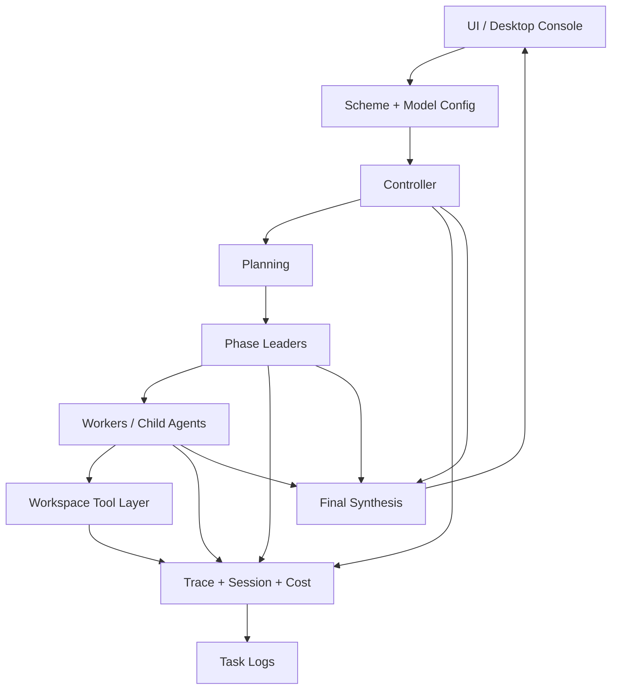
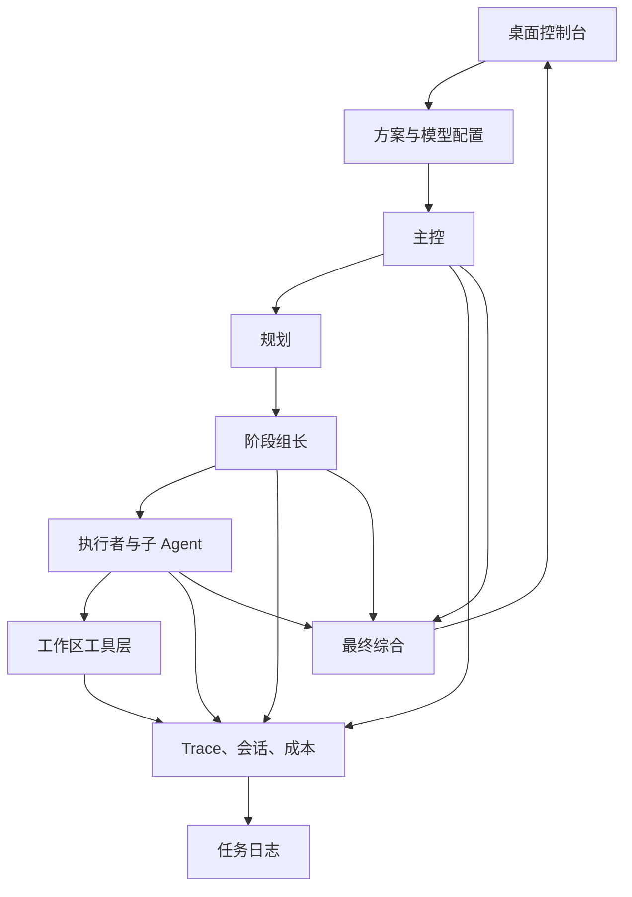

# Agent Cluster Workbench

<div align="center">

Local-first multi-model agent cluster console for orchestration, workspace execution, trace visualization, session memory, cost tracking, guarded delegation, and desktop packaging.

<p>
  <a href="#english">English</a>
  |
  <a href="#zh-cn">简体中文</a>
</p>

<p>
  <a href="./README.en.md">English</a>
  |
  <a href="./README.zh-CN.md">Simplified Chinese</a>
</p>

[English](./README.en.md) | [Simplified Chinese](./README.zh-CN.md)

<p>
  
  
  
  
  
</p>

</div>

## At A Glance

| Dimension | Summary |
| --- | --- |
| Positioning | A desktop-oriented runtime for controller-led multi-agent execution |
| Core Runtime | Schemes, staged routing, workspace tools, session memory, retry, fallback, circuit breaker |
| Observability | Live status feed, Task Trace, call chain, virtual cluster graph, per-agent public thinking summaries |
| Safety | Capability-aware routing, task-scope guards, workspace command policy, Git-safe local artifacts |
| Diagnostics | Basic reply probe, web-search probe, Thinking-mode probe |
| Delivery | Local web console plus packaged `dist/AgentClusterWorkbench.exe` |

## Capability Matrix

| Capability | Included |
| --- | --- |
| Controller / leader / child-agent delegation | Yes |
| Research / implementation / validation / handoff stages | Yes |
| Workspace file and command tool layer | Yes |
| Task Trace and call-chain visualization | Yes |
| Session memory, token usage, cost estimation | Yes |
| Retry, fallback, circuit breaker | Yes |
| Per-model Thinking toggle | Yes |
| Web-search capability verification | Yes |
| Chinese / English runtime UI | Yes |
| Windows single-file packaging | Yes |

## Module Layers

```text
UI Layer
  src/static/        web UI, trace panels, agent graph, connectivity console

Runtime Orchestration
  src/cluster/       controller planning, staged routing, delegation, synthesis
  src/session/       session memory, trace spans, retries, cost and token accounting

Execution Adapters
  src/providers/     OpenAI / Anthropic / Kimi-compatible provider adapters
  src/workspace/     workspace file tools, command policy, artifact generation

Server / Packaging
  src/http/          API routes for settings, runs, connectivity tests, logs
  scripts/           packaging, verification, syntax checks
```

## Execution Flow



## Runtime Characteristics

- Operates as a constrained multi-agent runtime with controller-led orchestration.
- Separates controller authority, worker capability, and child-agent inheritance.
- Keeps workspace execution explicit, policy-scoped, and auditable.
- Uses connectivity checks to verify whether web search and Thinking actually execute.
- Treats packaging, runtime logs, local secrets, and workspace outputs as operational concerns.

---

<a id="english"></a>

## English

### Overview

Agent Cluster Workbench is a local-first control plane for running multi-model agent clusters on desktop. It coordinates controller models, specialist workers, delegated child agents, and workspace tools while keeping the whole run visible and bounded.

This project already includes:

- scheme-based model routing
- staged research / implementation / validation / handoff execution
- task trace and call-chain visualization
- workspace file and command tooling with task-scope guards
- session memory, retries, fallback, circuit breakers, token and cost summaries
- connectivity diagnostics for basic reply, web search, and Thinking mode
- Windows EXE packaging

### Runtime Model

- Agent execution is organized as runtime infrastructure rather than a single chat surface.
- Controller responsibility, worker capability, and child-agent scope are separated.
- Workspace access runs through a governed tool layer instead of implicit side effects.
- Advanced capabilities are verified through runtime checks.
- Packaging, debugging, and maintenance are part of the project structure.

### Quick Start

```powershell
npm install
npm start
```

Development:

```powershell
npm run dev
```

Validation:

```powershell
npm test
npm run test:smoke
npm run test:unit
npm run check
```

Default address:

```text
http://127.0.0.1:4040
```

### Thinking and Web Search

- `OpenAI Responses`: enabling Thinking sends a `reasoning` payload. If no effort is selected, the runtime defaults to `medium`.
- `Claude` / `Kimi Coding`: enabling Thinking sends an Anthropic-compatible `thinking` payload with effort-based budget mapping.
- `Kimi Chat`: Thinking works for normal chat calls. If the same request enables built-in web search, the runtime disables Thinking automatically for compatibility.
- The `Connectivity` panel verifies these paths separately:
  basic reply, web-search execution, and Thinking-mode execution.

### Build and Packaging

```powershell
npm run build:win-exe
```

Output:

```text
dist/AgentClusterWorkbench.exe
```

By default, the packaged EXE embeds `cluster.config.blank.json`, not your local `cluster.config.json` or `runtime.settings.json`.

If you explicitly override the base config before building, the packaged EXE may include custom runtime data:

```powershell
$env:AGENT_CLUSTER_BASE_CONFIG = "cluster.config.json"
npm run build:win-exe
```

### Git Safety and Privacy

The repository ignores local-sensitive runtime artifacts by default, including:

- `.env`, `.env.local`, and local env variants
- `cluster.config.json`
- `runtime.settings.json`
- `dist/runtime.settings.json`
- local encryption key files
- `workspace/` and `dist/workspace/`
- `task-logs/` and `dist/task-logs/`
- `bot-connectors/`
- `build/sea/`
- `dist-verify/`
- packaged files such as `dist/*.exe`, `dist/*.zip`, and `dist/*.blockmap`

Important:

- `runtime.settings.json` stores secrets in encrypted form, but it still should not be committed.
- `.gitignore` only protects untracked files. If a sensitive file was tracked earlier, remove it from the Git index first:

```powershell
git rm --cached cluster.config.json runtime.settings.json dist/runtime.settings.json dist/AgentClusterWorkbench.exe
```

### FAQ

#### Why is there both a controller and worker model layer?

Because planning, delegation, synthesis, and concrete execution have different failure modes and capability needs. Separating them gives you better routing, better fallback, and clearer traces.

#### Why test Thinking and web search separately?

Because “connects successfully” is weaker than “the feature really runs.” The project explicitly verifies real capability paths instead of assuming provider claims are enough.

#### Will the EXE contain my API keys?

Not by default. The normal packaging path embeds `cluster.config.blank.json`, not your local runtime settings. The risk only appears if you explicitly override the base config before building.

#### Why keep independent language docs if this file is bilingual?

The root `README.md` acts as a landing page. `README.en.md` and `README.zh-CN.md` remain useful as direct links for repositories, releases, or external references.

### Attribution and License

- Author: 想画世界送给你
- License: `GPL-2.0-only`
- Full text: [LICENSE](./LICENSE)

---

<a id="zh-cn"></a>

## 简体中文

### 项目概述

Agent Cluster Workbench 是一个本地优先的多模型 Agent 集群控制台，用来统一调度主控模型、专业工作模型、下属子 Agent 和工作区工具链，并把执行过程、权限边界和运行状态完整呈现出来。

这个项目已经不是简单的聊天外壳，而是一套带运行时能力的桌面化 Agent 系统，当前已经包含：

- 基于方案的多模型路由
- 研究 / 实现 / 验证 / 交付分阶段执行
- 任务 Trace 与调用链可视化
- 带任务作用域限制的工作区文件与命令工具层
- 会话记忆、重试、fallback、熔断、Token 与成本统计
- 基础回复、联网搜索、Thinking 模式三类通联诊断
- Windows 单文件 EXE 打包

### 运行模型

- Agent 执行被组织为一套运行时基础设施，而不是单轮聊天界面。
- 主控职责、工作模型能力和子 Agent 继承边界被明确拆开。
- 工作区访问通过可治理、可审计的工具层执行，不依赖隐式副作用。
- 高级能力通过实际运行链路进行校验，而不只是检测是否连通。
- 打包、排错、维护和交付都纳入了项目结构本身。

### 执行流



### 快速开始

```powershell
npm install
npm start
```

开发模式：

```powershell
npm run dev
```

验证：

```powershell
npm test
npm run test:smoke
npm run test:unit
npm run check
```

默认地址：

```text
http://127.0.0.1:4040
```

### Thinking 与联网搜索

- `OpenAI Responses`：开启 Thinking 后会发送 `reasoning` 参数；如果没有单独指定强度，运行时默认使用 `medium`。
- `Claude` / `Kimi Coding`：开启 Thinking 后会发送 Anthropic 兼容的 `thinking` 参数，并根据强度映射不同预算。
- `Kimi Chat`：普通请求支持 Thinking；如果同一请求里同时启用内置联网搜索，运行时会为了兼容性自动关闭 Thinking。
- 左侧 `模型通联` 面板会分别验证三类路径：
  基础回复、联网搜索执行、Thinking 模式执行。

### 构建与打包

```powershell
npm run build:win-exe
```

输出位置：

```text
dist/AgentClusterWorkbench.exe
```

默认情况下，打包产物内置的是 `cluster.config.blank.json`，不会直接把你的本地 `cluster.config.json` 或 `runtime.settings.json` 打进去。

如果你在打包前显式覆盖基础配置，EXE 才可能带入本地运行数据：

```powershell
$env:AGENT_CLUSTER_BASE_CONFIG = "cluster.config.json"
npm run build:win-exe
```

### Git 安全与隐私

仓库默认忽略以下本地敏感文件和运行产物：

- `.env`、`.env.local` 以及本地环境变量变体
- `cluster.config.json`
- `runtime.settings.json`
- `dist/runtime.settings.json`
- 本地加密密钥文件
- `workspace/` 与 `dist/workspace/`
- `task-logs/` 与 `dist/task-logs/`
- `bot-connectors/`
- `build/sea/`
- `dist-verify/`
- `dist/*.exe`、`dist/*.zip`、`dist/*.blockmap` 等打包产物

注意：

- `runtime.settings.json` 虽然会对密钥做加密存储，但仍然不应该提交到仓库。
- `.gitignore` 只对未跟踪文件生效。如果某个敏感文件之前已经被 Git 跟踪，需要先从索引里移除：

```powershell
git rm --cached cluster.config.json runtime.settings.json dist/runtime.settings.json dist/AgentClusterWorkbench.exe
```

### FAQ

#### 为什么要分主控层和工作模型层？

因为规划、委派、综合和具体执行面对的是不同的失败模式与能力要求。拆开以后，路由更清晰，fallback 更好做，Trace 也更容易看懂。

#### 为什么要把 Thinking 和联网搜索分开测试？

因为“能连通”不等于“能力真的能执行”。这个项目强调验证真实能力链路，而不是只相信 provider 的说明。

#### 打包后的 EXE 会不会包含我的 API Key？

默认不会。常规打包流程使用的是 `cluster.config.blank.json`，不是你的本地运行配置。只有你显式覆盖打包基础配置时，才需要额外注意。

#### 既然这个 README 已经双语了，为什么还保留独立中英文文档？

根 `README.md` 适合作为项目门面页；`README.en.md` 和 `README.zh-CN.md` 仍然适合做外部直链、发行页引用和单语阅读。

### 署名与协议

- 作者：想画世界送给你
- 开源协议：`GPL-2.0-only`
- 协议全文：[LICENSE](./LICENSE)
