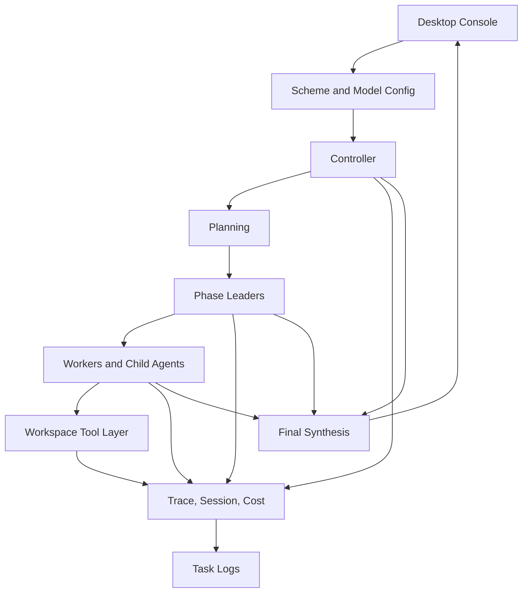

# Agent Cluster Workbench

<div align="center">

Desktop-first multi-model agent cluster runtime for controller-led orchestration, capability-aware delegation, traceable workspace execution, and packaged local delivery.

<p>
  <a href="./README.en.md">English</a>
  |
  <a href="./README.zh-CN.md">Simplified Chinese</a>
</p>

[English](./README.en.md) | [Simplified Chinese](./README.zh-CN.md)

<p>
  
  
  
  
  
</p>

</div>

## Overview

Agent Cluster Workbench is a local-first desktop runtime for running controller, leader, worker, and child-agent workflows across multiple model providers. It is structured as an execution system rather than a thin chat shell: tasks are routed by scheme, bounded by capability rules, observed through Task Trace and call chains, written into a governed workspace layer, and finally delivered through a local Windows package.

## At A Glance

| Dimension | Summary |
| --- | --- |
| Runtime shape | Controller-led multi-agent orchestration with staged execution |
| Stages | Research, implementation, validation, handoff |
| Observability | Live status feed, Task Trace, call chain, virtual cluster graph |
| Guardrails | Capability-aware routing, child-agent inheritance, workspace policy |
| Runtime state | Session memory, retry, fallback, circuit breaker, cost estimates |
| Delivery target | Local web console and packaged `dist/AgentClusterWorkbench.exe` |

## Capability Matrix

| Capability | Included |
| --- | --- |
| Controller / leader / worker delegation | Yes |
| Child-agent inheritance of enabled capabilities | Yes |
| Workspace file and command tool layer | Yes |
| Task Trace and call-chain visualization | Yes |
| Session memory, token usage, cost summaries | Yes |
| Retry, fallback, circuit breaker | Yes |
| Per-model Thinking mode toggle | Yes |
| Web-search capability verification | Yes |
| Chinese / English runtime UI | Yes |
| Task log export and runtime cleanup | Yes |
| Windows EXE packaging | Yes |

## Module Layers

```text
UI Layer
  src/static/        web UI, trace panels, connectivity console, agent graph, chat pane

Runtime Orchestration
  src/cluster/       controller planning, staged routing, delegation, synthesis
  src/session/       trace spans, session memory, retries, cost accounting

Execution Adapters
  src/providers/     OpenAI / Anthropic / Kimi-compatible adapters
  src/workspace/     file tools, command policy, artifact generation

Server / Packaging
  src/http/          API routes for settings, runs, tests, logs
  scripts/           packaging, verification, syntax checks
```

## Execution Flow



## Quick Start

```powershell
npm install
npm start
```

Development mode:

```powershell
npm run dev
```

Validation:

```powershell
npm test
npm run test:smoke
npm run test:unit
npm run check
```

Default address:

```text
http://127.0.0.1:4040
```

## Kimi / Kimi Code Web Search Setup

- `Kimi Chat`: use provider `kimi-chat` with `Base URL` set to `https://api.moonshot.cn/v1`. When `Allow Web Search` is enabled, the runtime turns on Moonshot's built-in `$web_search` tool and disables Thinking automatically for compatibility.
- `Kimi Coding` / `Kimi Code`: use provider `kimi-coding` with `Base URL` set to `https://api.moonshot.cn/anthropic`, not the older `/v1` route. When `Allow Web Search` is enabled, the runtime sends the Anthropic-compatible `web_search_20250305` server tool.
- Connectivity tests verify real execution paths instead of only checking whether a provider returns a basic response.

## Thinking Mode

- `OpenAI Responses`: enabling Thinking sends a `reasoning` payload. If no effort is selected, the runtime defaults to `medium`.
- `Claude` / `Kimi Coding`: enabling Thinking sends an Anthropic-compatible `thinking` payload with effort-mapped budget.
- `Kimi Chat`: Thinking works for normal chat requests. If built-in web search is enabled in the same request, the runtime disables Thinking automatically for compatibility.

## Build and Packaging

```powershell
npm run build:win-exe
```

Output:

```text
dist/AgentClusterWorkbench.exe
```

By default, packaging embeds `cluster.config.blank.json`, not your local `cluster.config.json` or `runtime.settings.json`.

If you explicitly override the base config before building, the packaged EXE may include your custom runtime data:

```powershell
$env:AGENT_CLUSTER_BASE_CONFIG = "cluster.config.json"
npm run build:win-exe
```

## Privacy and Git Safety

The repository ignores local-sensitive runtime artifacts by default, including:

- `.env`, `.env.local`, and local environment variants
- `cluster.config.json`
- `runtime.settings.json`
- `dist/runtime.settings.json`
- local encryption key files
- `workspace/` and `dist/workspace/`
- `task-logs/` and `dist/task-logs/`
- `bot-connectors/`
- `build/sea/`
- `dist-verify/`
- packaged artifacts such as `dist/*.exe`, `dist/*.zip`, and `dist/*.blockmap`

Important:

- `runtime.settings.json` stores secrets in encrypted form, but it still should not be committed.
- `.gitignore` only protects untracked files. If a sensitive file was tracked earlier, remove it from the Git index first:

```powershell
git rm --cached cluster.config.json runtime.settings.json dist/runtime.settings.json dist/AgentClusterWorkbench.exe
```

## Runtime Behavior

- Controller authority, worker capability, and child-agent inheritance are separated deliberately.
- Final deliverables are retained while transient cluster artifacts can be cleaned after the run.
- Task logs are exported outside the workspace so maintenance data does not pollute delivery outputs.
- Connectivity testing checks whether advanced features really execute, not just whether the provider returns a reply.

## Attribution and License

- Author: 想画世界送给你
- License: `MIT`
- Full text: [LICENSE](./LICENSE)
