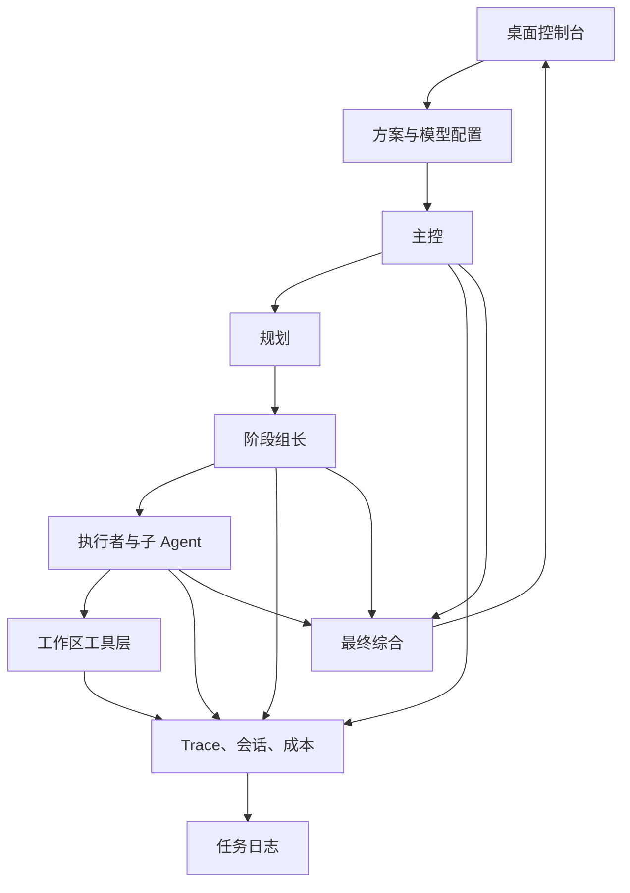

# Agent Cluster Workbench

<div align="center">

面向桌面的本地优先多模型 Agent 集群运行台，用于主控编排、能力感知分工、可追踪工作区执行，以及可打包的本地交付。

[项目首页 README](./README.md) | [English](./README.en.md)

<p>
  
  
  
  
  
</p>

</div>

## 项目概览

Agent Cluster Workbench 是一个本地优先的桌面 Agent 集群控制台，用来统一组织主控、组长、执行者和子 Agent 在多个模型提供方之间协同工作。它不是简单的聊天外壳，而是一套正式的运行时系统：任务按方案路由，按能力边界分工，按策略限制工具，按 Trace 回放全过程，并最终打包为本地桌面应用。

## 一览

| 维度 | 说明 |
| --- | --- |
| 运行形态 | 以主控为中心的多 Agent 分阶段编排 |
| 执行阶段 | 调研、实现、验证、交付 |
| 可观测性 | 实时状态流、Task Trace、调用链、虚拟集群图 |
| 安全边界 | 能力感知路由、子 Agent 能力继承、工作区策略限制 |
| 运行状态 | 会话记忆、重试、fallback、熔断、成本估算 |
| 交付形态 | 本地 Web 控制台与 `dist/AgentClusterWorkbench.exe` |

## 能力矩阵

| 能力 | 是否内置 |
| --- | --- |
| 主控 / 组长 / 执行 Agent 分工 | 是 |
| 子 Agent 继承父 Agent 已启用能力 | 是 |
| 工作区文件与命令工具层 | 是 |
| Task Trace 与调用链可视化 | 是 |
| 会话记忆、Token 与成本统计 | 是 |
| 重试、fallback、熔断 | 是 |
| 模型级 Thinking 开关 | 是 |
| Web Search 可用性验证 | 是 |
| 中英双语运行界面 | 是 |
| 任务日志导出与运行后清理 | 是 |
| Windows EXE 打包 | 是 |

## 模块分层

```text
UI 层
  src/static/        Web UI、Trace 面板、通联测试、集群图、协作聊天室

运行时编排层
  src/cluster/       主控规划、阶段路由、分工、综合
  src/session/       Trace、会话记忆、重试、成本统计

执行适配层
  src/providers/     OpenAI / Anthropic / Kimi 兼容适配器
  src/workspace/     文件工具、命令策略、产物写入

服务与打包层
  src/http/          设置、执行、测试、日志接口
  scripts/           打包、校验、语法检查脚本
```

## 执行流



## 快速开始

```powershell
npm install
npm start
```

开发模式：

```powershell
npm run dev
```

验证：

```powershell
npm test
npm run test:smoke
npm run test:unit
npm run check
```

默认地址：

```text
http://127.0.0.1:4040
```

## Kimi / Kimi Code 联网搜索配置

- `Kimi Chat`：使用 provider `kimi-chat`，`Base URL` 设为 `https://api.moonshot.cn/v1`。启用“允许 Web Search”后，程序会按 Moonshot 官方方式开启内置 `$web_search` 工具，并为兼容性自动关闭 Thinking。
- `Kimi Coding` / `Kimi Code`：使用 provider `kimi-coding`，`Base URL` 应设置为 `https://api.moonshot.cn/anthropic`，不是旧的 `/v1`。启用“允许 Web Search”后，程序会发送 Anthropic 兼容的 `web_search_20250305` 服务端工具。
- 模型通联测试验证的是实际执行链路，而不是只看接口能否返回一句基础回复。

## Thinking 模式

- `OpenAI Responses`：启用后会发送 `reasoning` 参数；若未单独选择强度，运行时默认使用 `medium`。
- `Claude` / `Kimi Coding`：启用后会发送 Anthropic 兼容的 `thinking` 参数，并按强度映射预算。
- `Kimi Chat`：普通聊天请求支持 Thinking；若同一请求同时启用了内置 Web Search，运行时会为兼容性自动关闭 Thinking。

## 构建与打包

```powershell
npm run build:win-exe
```

输出位置：

```text
dist/AgentClusterWorkbench.exe
```

默认情况下，打包会内置 `cluster.config.blank.json`，不会直接把你的本地 `cluster.config.json` 或 `runtime.settings.json` 打进去。

如果你在打包前显式覆盖基础配置，EXE 才可能带入你的自定义运行数据：

```powershell
$env:AGENT_CLUSTER_BASE_CONFIG = "cluster.config.json"
npm run build:win-exe
```

## 隐私与 Git 安全

仓库默认忽略以下本地敏感文件和运行产物：

- `.env`、`.env.local` 及本地环境变量变体
- `cluster.config.json`
- `runtime.settings.json`
- `dist/runtime.settings.json`
- 本地加密密钥文件
- `workspace/` 与 `dist/workspace/`
- `task-logs/` 与 `dist/task-logs/`
- `bot-connectors/`
- `build/sea/`
- `dist-verify/`
- `dist/*.exe`、`dist/*.zip`、`dist/*.blockmap` 等打包产物

注意：

- `runtime.settings.json` 即使是加密存储，也不应该提交到仓库。
- `.gitignore` 只保护未跟踪文件。若敏感文件之前已经被 Git 跟踪，需要先从索引中移除：

```powershell
git rm --cached cluster.config.json runtime.settings.json dist/runtime.settings.json dist/AgentClusterWorkbench.exe
```

## 运行特点

- 主控权责、执行模型能力、子 Agent 继承边界是拆开设计的。
- 最终交付产物会保留，集群运行中产生的中间副产物可在任务结束后清理。
- 任务日志单独导出到工作区之外，便于排障且不污染最终交付目录。
- 通联测试校验的是能力是否真正执行，而不是只看 provider 是否返回成功响应。

## 署名与协议

- 作者：想画世界送给你
- 开源协议：`GPL-2.0-only`
- 协议全文：[LICENSE](./LICENSE)
